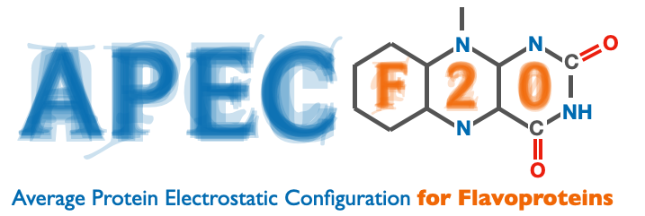

# Automated APEC-F 2.0

## Background


The construction of QM/MM models is usually a laborious and error-prone task that requires advanced user expertise. Furthermore, most traditional QM/MM methods only offer users a choice between using accurate electronic structure methods, which limits sampling, or approximate methods that allow for more extensive sampling of the protein dynamics. We focus on the large and important class of flavoproteins---it is estimated that around 1-3% of proteins are naturally bound to flavin, including three of the six major classes of photoreceptor proteins---for which we have developed and automated a computational protocol that automatically generates a QM/MM optimized model starting from a pdb crystal structure and a simple user input. The model uniquely makes use of the rigidity of flavin’s tricyclic core structure, freezing its coordinates during the molecular dynamics but optimizing it iteratively during the QM/MM steps to allow for the calculation of an averaged interaction between the QM and MM subsystems.

## Installation

```bash
git clone https://github.com/selhajj1/Automated-APEC.git
./setup.sh

```
## Link to APEC-F 2.0 manual
APEC-F 2.0 user and developer  manual can be accessed online, it contains all the information about the automated version and how to be run on a cluster.
The manual can be accessed through the following link: [APEC-F 2.0 Manual](http://gozemlab.com/APEC-F-2.0-Manual.pdf).

## Link to online youtube tutorial
A youtube video link is provided for the initial steps required to start running APEC-F 2.0: [Youtube video tutorial](https://www.youtube.com/watch?v=QKPV2fbTPbQ).

## Contributions

Samer Gozem Group

*Georgia State University*


